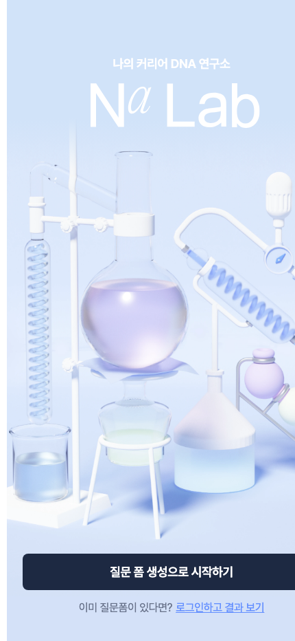

# Na Lab

동료의 익명 피드백을 통해 자신의 직무 강점을 발견하고 커리어 DNA를 정리하는 **Na Lab** 웹 클라이언트 복원본입니다. 원래 디자인과 survey → feedback → result → DNA 흐름을 유지하면서 최신 Next.js/Node 환경에서 다시 빌드 가능하도록 정리했습니다.

> 기존 팀 프로젝트의 개인 개발자 목록과 연락처는 README에서 제거했습니다. 원래 제품명, 화면, 기능 구조는 보존했습니다.

## Restored preview



위 이미지는 Next.js production build를 실제 실행한 뒤 430×932 viewport에서 캡처한 원래 홈 화면입니다.

## Product flow

1. 질문 폼을 생성합니다.
2. 링크를 공유해 동료 피드백을 받습니다.
3. 응답 결과를 정리해 강점과 피드백을 확인합니다.
4. 결과를 DNA/공유 이미지 형태로 활용합니다.

주요 라우트에는 survey, feedback, result, review, gallery, DNA 화면이 포함됩니다.

## Stack

- Next.js 16.3.3
- React 18
- TypeScript
- Emotion
- TanStack React Query
- Vitest

## Run

```bash
corepack enable
yarn install
yarn build
yarn test --run
```

현재 복원본 검증 결과:

- production build — success
- test files — 26 passed
- tests — 120 passed

일부 인증·분석·외부 서비스 연동은 실제 운영 credential을 저장소에 포함하지 않으므로 로컬 환경에 별도 설정이 필요합니다.
