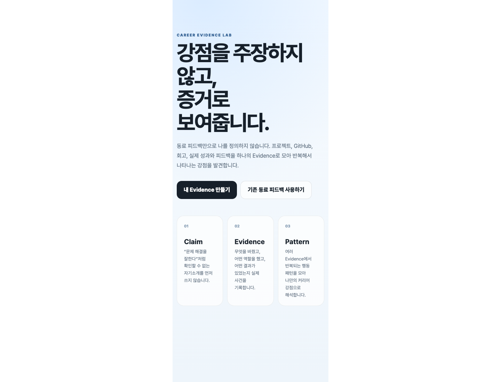

# Career Evidence Lab

Career Evidence Lab is a personal career-analysis workspace that turns concrete project evidence into a traceable map of strengths.

Instead of starting from self-descriptions, the product records what was actually built, changed, shipped, or learned and keeps a source beside each claim. GitHub repositories can be imported directly so README content, repository metadata, languages, and topics become evidence candidates rather than disconnected portfolio links.

## Product preview

| Evidence-first home | Evidence workspace |
| --- | --- |
|  |  |

두 캡처는 Next.js production build를 직접 실행해 촬영했습니다. 홈에서는 제품의 evidence-first 진입점을, workspace에서는 수동 기록과 GitHub source import를 같은 분석 흐름에서 다루는 화면을 확인할 수 있습니다.

## Core flow

1. Add evidence manually or import it from GitHub.
2. Keep the original source URL attached to every evidence item.
3. Tag recurring behaviours such as product thinking, problem solving, rapid prototyping, user empathy, technical ownership, and communication.
4. Review the aggregate pattern instead of relying on a single project or feedback item.

## GitHub evidence connector

`/api/github-evidence` reads public GitHub repository metadata and README content and returns evidence candidates with source URLs. Set `GITHUB_TOKEN` on the server to support authenticated requests and private repositories. The token is never sent to the browser.

## Stack

- Next.js 16.3.3 / React 18 / TypeScript 5.4
- Emotion
- React Query
- Vitest / Playwright
- GitHub REST API

## Local development

```bash
corepack enable
yarn install
yarn dev
```

Production build:

```bash
yarn build
```

## Deployment

Portfolio deployment: `https://career-evidence.oosu.dev`

The current repository is the personal product branch of the idea: the primary workflow is evidence capture, source traceability, GitHub import, and recurring-strength analysis.
